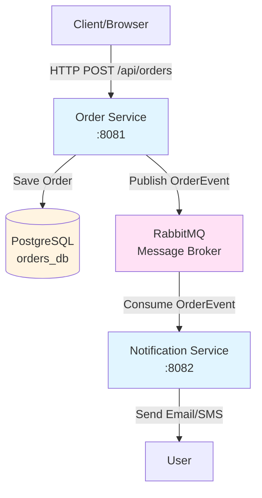

# Spring Boot + RabbitMQ + Kubernetes Demo

Demo microservices với Spring Boot, RabbitMQ, và Kubernetes deployment.

## 🏗️ Architecture



### Components

- **Order Service (Port 8081)**: REST API for creating and querying orders
  - Persists data to PostgreSQL
  - Publishes events to RabbitMQ
  
- **Notification Service (Port 8082)**: Consumes events from RabbitMQ
  - Sends notifications (email/SMS simulation)
  
- **PostgreSQL**: Database for Order Service
  - Stores order data
  
- **RabbitMQ**: Message broker (shared by both services)
  - Routes messages between services

## 🛠️ Tech Stack

- **Spring Boot 3.5.7**
- **Java 17**
- **PostgreSQL 15**
- **Spring Data JPA**
- **RabbitMQ 3.13**
- **Kubernetes**
- **Helm 3**
- **Docker**
- **Spring AMQP**
- **Swagger/OpenAPI 3.0 (SpringDoc 2.8.3)**

## 📦 Services

### Order Service (Port 8081)
- REST API for creating and querying orders
- PostgreSQL database persistence
- Publish events to RabbitMQ
- Swagger UI: `http://localhost:8081/swagger-ui.html`
- Endpoints:
  - `POST /api/orders` - Create order
  - `GET /api/orders/{orderId}` - Get order by ID
  - `GET /api/orders?customerId=CUST-001` - Get orders by customer

### Notification Service (Port 8082)
- Consume events from RabbitMQ
- Send notifications (email/SMS simulation)
- Swagger UI: `http://localhost:8082/swagger-ui.html`
- Endpoints:
  - `GET /api/notifications/info` - Service info

## 🚀 Quick Start

### Prerequisites

- **Java 17+**
- **Maven 3.6+**
- **Docker Desktop** (for local development)
- **kubectl** (for Kubernetes deployment)
- **Helm 3.0+** (for Helm deployment)
- **Kubernetes cluster** (for K8s/Helm deployment)

---

## 📍 Local Development

### 1. Start Infrastructure Services

```bash
# Start PostgreSQL and RabbitMQ
docker-compose up -d

# Check services are running
docker-compose ps

# View logs
docker-compose logs -f

# Stop services
docker-compose down
```

### 2. Run Order Service

```bash
cd order-service
mvn spring-boot:run
```

Order Service will be available at: `http://localhost:8081`

### 3. Run Notification Service

Open a new terminal:

```bash
cd notification-service
mvn spring-boot:run
```

Notification Service will be available at: `http://localhost:8082`

### Access Services

- **Order Service Swagger**: http://localhost:8081/swagger-ui.html
- **Notification Service Swagger**: http://localhost:8082/swagger-ui.html
- **RabbitMQ Management**: http://localhost:15672 (admin/admin123)
- **PostgreSQL**: localhost:5432 (postgres/postgres)

---

## ☸️ Kubernetes Deployment (Raw Manifests)

### Prerequisites

- Kubernetes cluster running
- `kubectl` configured
- Docker images built and pushed to registry (or use local images)

### 1. Build Docker Images

```bash
# Build Order Service
cd order-service
mvn clean package -DskipTests
docker build -t order-service:latest .

# Build Notification Service
cd ../notification-service
mvn clean package -DskipTests
docker build -t notification-service:latest .
```

### 2. Deploy Infrastructure

```bash
# Deploy PostgreSQL
kubectl apply -f k8s/manifests/postgres-configmap.yaml
kubectl apply -f k8s/manifests/postgres-secret.yaml
kubectl apply -f k8s/manifests/postgres-statefulset.yaml
kubectl apply -f k8s/manifests/postgres-service.yaml

# Deploy RabbitMQ
kubectl apply -f k8s/manifests/rabbitmq-secret.yaml
kubectl apply -f k8s/manifests/rabbitmq-statefulset.yaml
kubectl apply -f k8s/manifests/rabbitmq-service.yaml
```

### 3. Deploy Services

```bash
# Deploy Order Service
kubectl apply -f k8s/manifests/order-service-configmap.yaml
kubectl apply -f k8s/manifests/order-service-secret.yaml
kubectl apply -f k8s/manifests/order-service-deployment.yaml
kubectl apply -f k8s/manifests/order-service-service.yaml

# Deploy Notification Service
kubectl apply -f k8s/manifests/notification-service-configmap.yaml
kubectl apply -f k8s/manifests/notification-service-secret.yaml
kubectl apply -f k8s/manifests/notification-service-deployment.yaml
kubectl apply -f k8s/manifests/notification-service-service.yaml
```

Or deploy all at once:

```bash
kubectl apply -f k8s/manifests/
```

### 4. Access Services

**Understanding K8s Services and Ports:**

In Kubernetes:
- **Service Port**: Fixed port (8081, 8082) - defined in Service manifest, never changes
- **Multiple Pod Instances**: Service automatically load balances across all pod replicas
- **Port Forwarding**: Maps your local machine port to the service port for testing

**Example:** If you have 3 replicas of Order Service:
- All 3 pods listen on port 8081 (container port)
- Service exposes port 8081 (service port)
- Service load balances requests across all 3 pods
- Port forwarding: `kubectl port-forward svc/order-service 8081:8081` maps local:8081 → service:8081

```bash
# Port forward Order Service
# Format: kubectl port-forward svc/<service-name> <local-port>:<service-port>
kubectl port-forward svc/order-service 8081:8081

# Port forward Notification Service
kubectl port-forward svc/notification-service 8082:8082

# Port forward RabbitMQ Management
kubectl port-forward svc/rabbitmq-service 15672:15672
```

**Note:** For production, use Ingress or LoadBalancer service type instead of port-forwarding.

### 5. Check Status

```bash
# Check pods
kubectl get pods

# Check services
kubectl get svc

# Check logs
kubectl logs -f deployment/order-service
kubectl logs -f deployment/notification-service
```

### 6. Cleanup

```bash
kubectl delete -f k8s/manifests/
```

---

## 🎯 Helm Deployment (Recommended)

### Prerequisites

- Kubernetes cluster running
- `kubectl` configured
- `helm` 3.0+ installed
- Docker images built and pushed to registry

### 1. Build Docker Images

```bash
# Build Order Service
cd order-service
mvn clean package -DskipTests
docker build -t order-service:latest .

# Build Notification Service
cd ../notification-service
mvn clean package -DskipTests
docker build -t notification-service:latest .
```

### 2. Install with Default Values

```bash
helm install microservices-demo ./helm/microservices-demo
```

### 3. Install with Custom Values

```bash
# Override specific values
helm install microservices-demo ./helm/microservices-demo \
  --set orderService.replicaCount=3 \
  --set orderService.image.tag=v1.0.0

# Or use custom values file
helm install microservices-demo ./helm/microservices-demo \
  -f my-custom-values.yaml
```

### 4. Upgrade Deployment

```bash
helm upgrade microservices-demo ./helm/microservices-demo
```

### 5. Access Services

**Understanding K8s Services and Ports:**

In Kubernetes:
- **Service Port**: Fixed port (8081, 8082) - defined in Service manifest, never changes
- **Multiple Pod Instances**: Service automatically load balances across all pod replicas
- **Port Forwarding**: Maps your local machine port to the service port for testing

**Example:** If you have 3 replicas of Order Service:
- All 3 pods listen on port 8081 (container port)
- Service exposes port 8081 (service port)
- Service load balances requests across all 3 pods
- Port forwarding: `kubectl port-forward svc/order-service 8081:8081` maps local:8081 → service:8081

```bash
# Port forward Order Service
# Format: kubectl port-forward svc/<service-name> <local-port>:<service-port>
kubectl port-forward svc/order-service 8081:8081

# Port forward Notification Service
kubectl port-forward svc/notification-service 8082:8082

# Port forward RabbitMQ Management
kubectl port-forward svc/rabbitmq-service 15672:15672
```

**Note:** For production, use Ingress or LoadBalancer service type instead of port-forwarding.

### 6. Uninstall

```bash
helm uninstall microservices-demo
```

### Configuration

Edit `helm/microservices-demo/values.yaml` to customize:
- Replica counts
- Resource limits
- Image tags
- Database credentials
- Service ports

See [Helm Chart README](./helm/microservices-demo/README.md) for more details.

---

## 🧪 Testing

### Create Order via API

```bash
# Create an order
curl -X POST http://localhost:8081/api/orders \
  -H "Content-Type: application/json" \
  -d '{
    "customerId": "CUST-001",
    "amount": 99.99
  }'
```

### Query Orders

```bash
# Get order by ID (replace with actual order ID from create response)
curl http://localhost:8081/api/orders/{orderId}

# Get all orders for a customer
curl "http://localhost:8081/api/orders?customerId=CUST-001"
```

### Check Notification Service

```bash
# Get service info
curl http://localhost:8082/api/notifications/info
```

---

## 🔄 Message Flow

1. **User creates order** via `POST /api/orders`
2. **Order Service validates** request and generates order ID
3. **Order Service saves** order to PostgreSQL database
4. **Order Service publishes** `OrderEvent` to RabbitMQ exchange
5. **RabbitMQ routes** message to `notification.queue`
6. **Notification Service consumes** message from queue
7. **Notification Service processes** and sends email/SMS notification

---

## 📁 Project Structure

```
.
├── order-service/              # Order microservice
│   ├── src/
│   │   ├── main/java/         # Java source code
│   │   └── main/resources/    # Application config
│   ├── src/test/              # Unit tests
│   ├── Dockerfile             # Docker image definition
│   └── pom.xml                # Maven dependencies
│
├── notification-service/      # Notification microservice
│   ├── src/
│   │   ├── main/java/         # Java source code
│   │   └── main/resources/    # Application config
│   ├── src/test/              # Unit tests
│   ├── Dockerfile             # Docker image definition
│   └── pom.xml                # Maven dependencies
│
├── k8s/                       # Kubernetes raw manifests
│   └── manifests/             # YAML files for K8s resources
│       ├── order-service-*.yaml
│       ├── notification-service-*.yaml
│       ├── postgres-*.yaml
│       └── rabbitmq-*.yaml
│
├── helm/                      # Helm charts
│   └── microservices-demo/    # Helm chart
│       ├── Chart.yaml         # Chart metadata
│       ├── values.yaml        # Default values
│       └── templates/         # K8s template files
│
├── docker-compose.yml         # Local development (PostgreSQL + RabbitMQ)
├── .github/workflows/         # CI/CD pipeline
└── README.md                  # This file
```

---

## 🧪 Running Tests

```bash
# Run Order Service tests
cd order-service
mvn test

# Run Notification Service tests
cd ../notification-service
mvn test
```

---

## 📚 Documentation

- **Order Service Swagger**: http://localhost:8081/swagger-ui.html
- **Notification Service Swagger**: http://localhost:8082/swagger-ui.html
- **RabbitMQ Management**: http://localhost:15672 (admin/admin123)
- **API Docs**: http://localhost:8081/api-docs (Order Service)
- **API Docs**: http://localhost:8082/api-docs (Notification Service)

---

## 🔧 Configuration

### Environment Variables

**Order Service:**
- `DB_HOST` - PostgreSQL host (default: localhost)
- `DB_PORT` - PostgreSQL port (default: 5432)
- `DB_NAME` - Database name (default: orders_db)
- `DB_USERNAME` - Database username
- `DB_PASSWORD` - Database password
- `RABBITMQ_HOST` - RabbitMQ host (default: localhost)
- `RABBITMQ_PORT` - RabbitMQ port (default: 5672)
- `RABBITMQ_USERNAME` - RabbitMQ username
- `RABBITMQ_PASSWORD` - RabbitMQ password

**Notification Service:**
- `RABBITMQ_HOST` - RabbitMQ host (default: localhost)
- `RABBITMQ_PORT` - RabbitMQ port (default: 5672)
- `RABBITMQ_USERNAME` - RabbitMQ username
- `RABBITMQ_PASSWORD` - RabbitMQ password

---

## 🚀 CI/CD

GitHub Actions workflow automatically:
- Runs tests on push/PR
- Builds and tests both services
- Generates test reports

See `.github/workflows/ci.yml` for details.

---

## 📝 License

MIT
