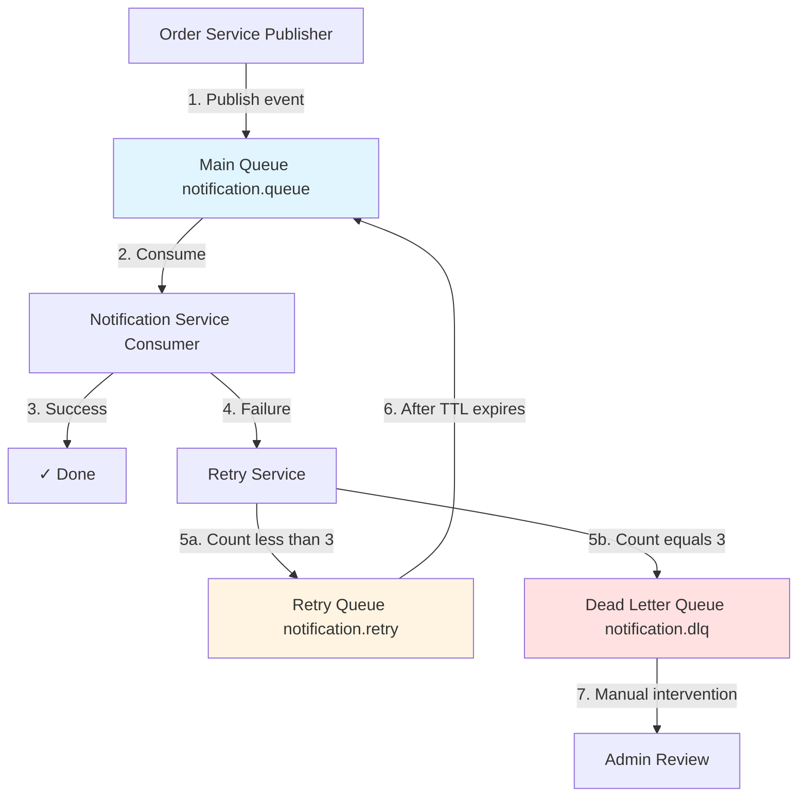

# RabbitMQ Architecture & Implementation Guide

## 📋 Table of Contents

- [Overview](#overview)
- [Architecture Pattern](#architecture-pattern)
- [Message Flow](#message-flow)
- [Queue Configuration](#queue-configuration)
- [Retry Mechanism](#retry-mechanism)
- [Code Implementation](#code-implementation)
- [Testing & Debugging](#testing--debugging)

---

## Overview

This project implements a robust RabbitMQ messaging system with a **3-Queue Pattern** for reliable message processing with automatic retry and dead letter handling.

### Key Features

- ✅ **Asynchronous Communication** between Order Service and Notification Service
- ✅ **3-Queue Pattern**: Main Queue → Retry Queue → Dead Letter Queue
- ✅ **Exponential Backoff Retry** (5s → 10s → 20s)
- ✅ **TTL (Time To Live)** for message expiration
- ✅ **DLQ (Dead Letter Queue)** for manual intervention
- ✅ **Service Interface Pattern** for clean architecture

---

## Architecture Pattern

### 3-Queue Pattern Overview



### Components

| Component | Queue Name | Purpose | TTL |
|-----------|-----------|---------|-----|
| **Main Queue** | `notification.queue` | Normal message processing | 5 minutes |
| **Retry Queue** | `notification.retry` | Temporary storage for retry | Per-message (5s/10s/20s) |
| **Dead Letter Queue** | `notification.dlq` | Failed messages after max retries | No TTL |

### Exchanges

| Exchange | Type | Purpose |
|----------|------|---------|
| `orders.exchange` | Direct | Main exchange for order events |
| `orders.dlx` | Direct | Dead Letter Exchange for routing failed messages |

---

## Message Flow

### 1. Normal Flow (Success)

```
1. Order Service publishes message to orders.exchange
   ↓
2. Message routed to notification.queue (routing key: order.created)
   ↓
3. Notification Service consumes and processes message
   ↓
4. Success → Message acknowledged and removed from queue
```

### 2. Retry Flow (Transient Failure)

```
1. Notification Service fails to process message (exception thrown)
   ↓
2. RetryService checks retry count (0, 1, or 2)
   ↓
3. RetryService sends message to orders.dlx with:
   - Routing key: notification.retry
   - TTL: 5s/10s/20s (exponential backoff)
   - Header: x-retry-count = current + 1
   ↓
4. Message lands in notification.retry queue
   ↓
5. After TTL expires, message automatically goes to orders.exchange
   ↓
6. Message routed back to notification.queue
   ↓
7. Notification Service retries processing
```

### 3. Dead Letter Flow (Permanent Failure)

```
1. Message fails 3 times (max retries exceeded)
   ↓
2. RetryService sends message to orders.dlx with:
   - Routing key: notification.dlq
   - Headers: x-retry-count=3, x-failure-reason, x-failure-timestamp
   ↓
3. Message lands in notification.dlq
   ↓
4. DLQ Consumer logs failure details
   ↓
5. Admin manually investigates and reprocesses
```

---

## Queue Configuration

### Main Queue Configuration

**Queue Name**: `notification.queue`

**Key Arguments**:
- `x-message-ttl`: 300000 (5 minutes) - Messages expire if not consumed
- `x-dead-letter-exchange`: `orders.dlx` - Route expired/rejected messages
- `x-dead-letter-routing-key`: `notification.retry` - Route to retry queue

**Binding**:
- Exchange: `orders.exchange`
- Routing Key: `order.created`

**Implementation**:
```java
@Bean
public Queue notificationQueue() {
    return QueueBuilder.durable(MAIN_QUEUE)
            .withArgument("x-message-ttl", 300000L)
            .withArgument("x-dead-letter-exchange", DLX)
            .withArgument("x-dead-letter-routing-key", RETRY_ROUTING_KEY)
            .build();
}
```

📄 **Full config**: [`order-service/config/RabbitMQConfig.java`](../order-service/src/main/java/com/demo/order/config/RabbitMQConfig.java)

---

### Retry Queue Configuration

**Queue Name**: `notification.retry`

**Purpose**: Temporary storage for messages awaiting retry

**Key Arguments**:
- `x-dead-letter-exchange`: `orders.exchange` - Return to main exchange after TTL
- `x-dead-letter-routing-key`: `order.created` - Route back to main queue

**TTL**: Set per-message (not on queue)
- Retry 1: 5 seconds
- Retry 2: 10 seconds  
- Retry 3: 20 seconds

**Important**: This queue has **NO consumer**. Messages automatically move to main queue after TTL expires.

**Implementation**:
```java
@Bean
public Queue retryQueue() {
    return QueueBuilder.durable(RETRY_QUEUE)
            .withArgument("x-dead-letter-exchange", EXCHANGE)
            .withArgument("x-dead-letter-routing-key", ROUTING_KEY)
            .build();
}
```

---

### Dead Letter Queue Configuration

**Queue Name**: `notification.dlq`

**Purpose**: Store permanently failed messages for manual intervention

**Configuration**: No TTL, no DLX (final destination)

**Consumer**: Has a dedicated consumer that logs failure details for admin review

**Implementation**:
```java
@Bean
public Queue deadLetterQueue() {
    return QueueBuilder.durable(DLQ).build();
}
```

---

## Retry Mechanism

### Exponential Backoff Strategy

| Attempt | Retry Count | Delay | Total Time |
|---------|-------------|-------|------------|
| 1st try | 0 | 0s | 0s |
| 1st retry | 1 | 5s | 5s |
| 2nd retry | 2 | 10s | 15s |
| 3rd retry | 3 | 20s | 35s |
| **→ DLQ** | **3** | **-** | **-** |

### TTL Types Explained

#### 1. Queue-Level TTL (Main Queue)

```java
.withArgument("x-message-ttl", 300000L) // 5 minutes
```

- **Applied to**: All messages in the queue
- **Purpose**: Prevent queue overflow with stale messages
- **Behavior**: Message expires after 5 minutes if not consumed

#### 2. Per-Message TTL (Retry Queue)

```java
properties.setExpiration(String.valueOf(delay)); // 5000, 10000, or 20000
```

- **Applied to**: Individual messages
- **Purpose**: Control retry delay (exponential backoff)
- **Behavior**: Each message has its own TTL based on retry count

### Retry Headers

Custom headers track message lifecycle:

| Header | Type | Purpose | Example |
|--------|------|---------|---------|
| `x-retry-count` | Integer | Track retry attempts | 0, 1, 2, 3 |
| `x-failure-reason` | String | Store error message | "Notification failed" |
| `x-failure-timestamp` | Long | Record failure time | 1736775000000 |

---

## Code Implementation

### Order Service (Publisher)

#### Publishing Messages

```java
@Service
@RequiredArgsConstructor
public class OrderEventPublisher {
    private final RabbitTemplate rabbitTemplate;
    
    public void publishOrderCreated(Order order) {
        OrderEvent event = new OrderEvent(/* ... */);
        
        rabbitTemplate.convertAndSend(
            RabbitMQConfig.EXCHANGE,
            RabbitMQConfig.ROUTING_KEY,
            event
        );
    }
}
```

📄 **Full implementation**: [`OrderEventPublisher.java`](../order-service/src/main/java/com/demo/order/publisher/OrderEventPublisher.java)

---

### Notification Service (Consumer)

#### Retry Service Interface

```java
public interface RetryService {
    void handleRetry(OrderEvent orderEvent, Exception exception, Message message);
}
```

#### Key Methods

**1. Handle Retry Logic**:
```java
public void handleRetry(OrderEvent orderEvent, Exception exception, Message message) {
    int retryCount = getRetryCount(message);
    
    if (retryCount >= MAX_RETRIES) {
        sendToDLQ(orderEvent, exception, message);
    } else {
        sendToRetryQueue(orderEvent, retryCount, message);
    }
}
```

**2. Send to Retry Queue**:
```java
private void sendToRetryQueue(OrderEvent orderEvent, int retryCount, Message originalMessage) {
    long delay = RETRY_DELAYS[retryCount]; // 5000, 10000, or 20000
    
    MessageProperties properties = new MessageProperties();
    properties.setExpiration(String.valueOf(delay)); // Per-message TTL
    properties.setHeader("x-retry-count", retryCount + 1);
    
    Message retryMessage = rabbitTemplate.getMessageConverter()
        .toMessage(orderEvent, properties);
    
    rabbitTemplate.send(DLX, RETRY_ROUTING_KEY, retryMessage);
}
```

**3. Send to Dead Letter Queue**:
```java
private void sendToDLQ(OrderEvent orderEvent, Exception exception, Message originalMessage) {
    MessageProperties properties = new MessageProperties();
    properties.setHeader("x-retry-count", MAX_RETRIES);
    properties.setHeader("x-failure-reason", exception.getMessage());
    properties.setHeader("x-failure-timestamp", System.currentTimeMillis());
    
    Message dlqMessage = rabbitTemplate.getMessageConverter()
        .toMessage(orderEvent, properties);
    
    rabbitTemplate.send(DLX, DLQ_ROUTING_KEY, dlqMessage);
}
```

📄 **Full implementation**: 
- [`RetryService.java`](../notification-service/src/main/java/com/demo/notification/service/RetryService.java) (Interface)
- [`RetryServiceImpl.java`](../notification-service/src/main/java/com/demo/notification/service/RetryServiceImpl.java) (Implementation)

---

#### Consumer Implementation

**Main Queue Consumer**:
```java
@RabbitListener(queues = RabbitMQConfig.MAIN_QUEUE)
public void handleOrderCreated(OrderEvent orderEvent, Message message) {
    try {
        notificationService.processOrderNotification(orderEvent);
        log.info("✅ Success: {}", orderEvent.getOrderId());
    } catch (Exception e) {
        log.error("❌ Failed: {}", orderEvent.getOrderId());
        retryService.handleRetry(orderEvent, e, message);
    }
}
```

**Dead Letter Queue Consumer**:
```java
@RabbitListener(queues = RabbitMQConfig.DLQ)
public void handleDeadLetter(OrderEvent orderEvent, Message message) {
    log.error("💀 Message in DLQ - manual intervention required");
    
    // Extract failure details from headers
    Object failureReason = message.getMessageProperties()
        .getHeaders().get("x-failure-reason");
    
    // In production: Send alerts, create tickets, store for review
}
```

📄 **Full implementation**: [`OrderEventConsumer.java`](../notification-service/src/main/java/com/demo/notification/consumer/OrderEventConsumer.java)

---

## Testing & Debugging

### Access RabbitMQ Management UI

```bash
# Local development
http://localhost:15672
Username: admin
Password: admin123
```

### Monitor Queues

Check queue status in RabbitMQ Management:

1. **Queues Tab**
   - `notification.queue` - Should show active consumers
   - `notification.retry` - Should show 0 consumers (no direct consumer)
   - `notification.dlq` - Should show 1 consumer

2. **Key Metrics**
   - **Ready**: Messages waiting to be consumed
   - **Unacked**: Messages being processed
   - **Total**: Total messages in queue

### Test Retry Flow

```bash
# 1. Stop Notification Service to simulate failure
# 2. Create an order
curl -X POST http://localhost:8081/api/orders \
  -H "Content-Type: application/json" \
  -d '{"customerId": "CUST-001", "amount": 99.99}'

# 3. Check RabbitMQ Management UI
# - Message will stay in notification.queue (Ready: 1)

# 4. Start Notification Service
# - If processing fails, message moves to notification.retry
# - After TTL (5s/10s/20s), message returns to notification.queue
# - After 3 retries, message goes to notification.dlq
```

### View Message Headers

In RabbitMQ Management UI:
1. Go to **Queues** → Select queue
2. Click **Get Messages**
3. View headers and payload

**Example Headers**:
```json
{
  "x-retry-count": 2,
  "content_type": "application/json",
  "timestamp": 1736775000000
}
```

### Debug Logs

Enable debug logs in `application.yml`:

```yaml
logging:
  level:
    org.springframework.amqp: DEBUG
    com.demo: DEBUG
```

Look for:
- `Publishing order created event: orderId=...`
- `Received OrderEvent from RabbitMQ (Main Queue)`
- `Retry attempt 2/3 for orderId=...`
- `Message sent to DLQ. OrderId: ...`

---

## Common Issues & Solutions

### Issue 1: Messages stuck in queue

**Symptom**: Messages in `notification.queue` but not consumed

**Solution**:
```bash
# Check if Notification Service is running
kubectl get pods | grep notification

# Check consumer logs
kubectl logs -f deployment/notification-service
```

---

### Issue 2: PRECONDITION_FAILED error

**Symptom**: `inequivalent arg 'x-message-ttl' for queue`

**Cause**: Queue already exists with different configuration

**Solution**: Delete and recreate queue
```bash
# Access RabbitMQ Management UI
# Go to Queues → Select queue → Delete
# Restart services to recreate with correct config
```

---

### Issue 3: Messages not retrying

**Symptom**: Failed messages not appearing in retry queue

**Solution**: Ensure exception is caught and `RetryService` is called

```java
catch (Exception e) {
    retryService.handleRetry(orderEvent, e, message); // Must be called!
}
```

---

## Performance Considerations

### 1. Prefetch Count

Control how many messages a consumer processes concurrently:

```yaml
spring:
  rabbitmq:
    listener:
      simple:
        prefetch: 10  # Process 10 messages at a time
```

**Benefits**:
- Prevents consumer overload
- Better load balancing between multiple consumers
- Avoids one consumer taking all messages

---

### 2. Connection Pooling

Reuse channels instead of creating new ones:

```yaml
spring:
  rabbitmq:
    cache:
      channel:
        size: 25  # Reuse 25 channels
```

**Benefits**:
- Reduces overhead of channel creation/destruction
- Improves throughput

---

### 3. Message Persistence

**Current Implementation**: All queues are **durable** (survive RabbitMQ restarts)

```java
QueueBuilder.durable(QUEUE_NAME) // Durable = true
```

**Benefits**:
- Messages survive RabbitMQ restarts
- Queue definitions persist

---

## Best Practices

1. ✅ **Always use durable queues** - Survive RabbitMQ restarts
2. ✅ **Set reasonable TTL** - Prevent queue overflow (Main Queue: 5 min)
3. ✅ **Implement exponential backoff** - Avoid overwhelming services
4. ✅ **Log all DLQ messages** - Include failure reason and timestamp
5. ✅ **Monitor queue depths** - Set up alerts for unusual growth
6. ✅ **Use Service Interface pattern** - Better testability and maintainability
7. ✅ **Copy original headers** when resending - Preserve message context
8. ✅ **Set MAX_RETRIES** - Avoid infinite retry loops

---

## Key Takeaways

### Durable Queue vs Retry Queue

**"Durable"** refers to **persistence**, not retry logic:
- **Durable = true**: Queue survives RabbitMQ restart
- **Retry Queue**: A separate queue for delayed retry attempts

All 3 queues (Main, Retry, DLQ) are **durable** in this implementation.

### Why No Consumer on Retry Queue?

The Retry Queue uses **automatic message expiration** via TTL:
1. Message sent to Retry Queue with per-message TTL
2. After TTL expires, RabbitMQ automatically routes to DLX
3. DLX routes back to Main Queue (via DLX configuration)
4. Main Queue consumer processes the message again

No consumer needed - RabbitMQ handles routing automatically!

---

## References

- [Spring AMQP Documentation](https://docs.spring.io/spring-amqp/reference/)
- [RabbitMQ TTL Documentation](https://www.rabbitmq.com/ttl.html)
- [RabbitMQ Dead Letter Exchanges](https://www.rabbitmq.com/dlx.html)
- [Main README](../README.md)
